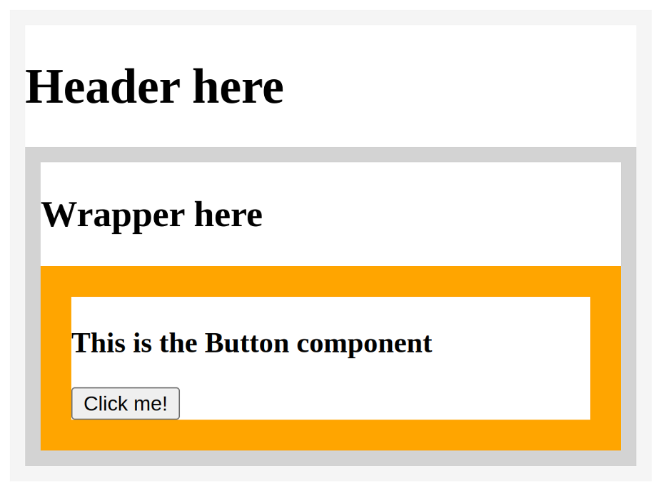
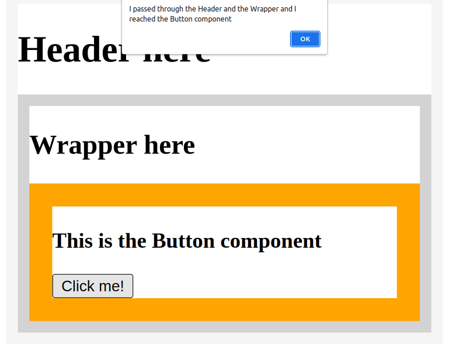

# Prop drilling Demo

## About Prop drilling

__Prop drilling__ is a situation where you are passing data from a parent to a child component, then to a grandchild component, and so on, until it reaches a more distant component further down the component tree, where this data is required.

## About this app

This is a very simple app that focuses on the process of props passing through several components.

Please note that the goal here is not to build an app that would exist in the real world. The goal of this app is to examine the practice of __prop drilling__, so that you can focus on it and understand it in isolation.

This app is simple enough that you should be able to understand it on your own. Let’s address the main points to highlight what is happening in the `App.js` file.

The top-most component of this app is the `App` component. The `App` component returns the `Main` component. The `Main` component accepts a single attribute, named `msg`, as in "message".

At the very top of the app, the `Main` function declares how the `Main` component should behave. The `Main` component is responsible for rendering the `Header` component. Note that when the `Header` component is rendered from inside `Main`, it also receives the `msg` prop.

The `Header` component’s function declaration renders an `h1` that reads "Header here", then another component named `Wrapper`. Note that the naming here is irrelevant – the components `Header` and `Wrapper` are named to make it a bit more like it might appear in a real app – but ultimately, the focus is on having multiple components, rather than describing specific component names properly.

So, the `Header` component’s function declaration has a `return` statement, which renders the `Wrapper` component with the `msg` prop passed to it.

In the `Wrapper` component’s function declaration, there’s an `h2` that reads "Wrapper here", in addition to the rendering of the `Button` component, which also receives the `msg` attribute.

Finally, the `Button` component’s function declaration is coded to receive the props object, then inside of the wrapping `div`, show an `h3`. The `h3` reads "This is the Button component", and then, under that, there’s a button element with an `onClick` event-handling attribute. This is passed to an arrow function which should alert the string that comes from the `props.msg` prop.

All this code results in the following UI rendered on the screen:

This screenshot illustrates the boundaries of each component. The `Main` component can’t be found in the UI because it’s just rendering the `Header` component. The `Header` component then renders the `Wrapper` component, and the `Wrapper` component then renders the `Button` component.

Note that the string that was passed on and on through each of the children component’s props’ objects is not found anywhere. However, it will appear when you click the "Click me!" button, as an alert:

The alert’s message reads "I passed through the Header and the Wrapper and I reached the Button component".

That’s really all there is to it. __Props drilling__ simply means passing a prop through props objects through several layers of components. The more layers there are, the more repetitive and unnecessary this feels.