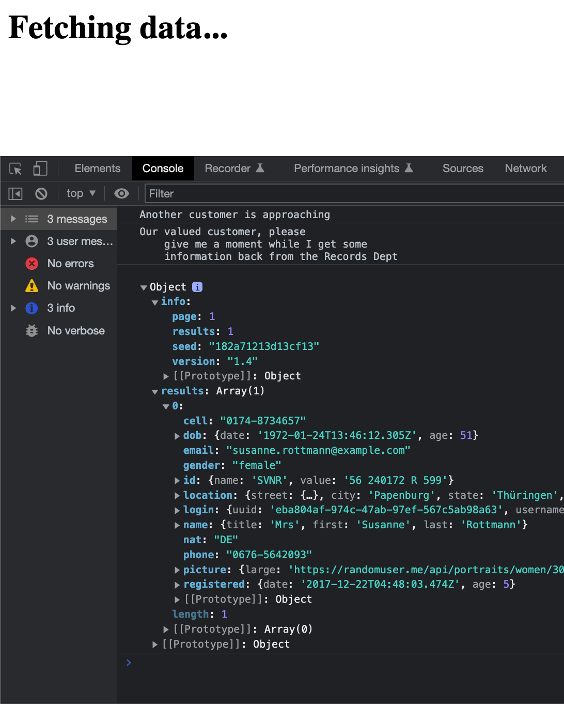

# What you need to know before fetching data Demo

Open the `what-you-need-to-know-before-fetching-data.html` file in the browser and inspect the console.

Since JavaScript can only do one single thing at any given time, the sequence of console logs from the code will be as follows

1. An initial console log that outputs `Another customer is approaching`,
2. A second console log that outputs `Our valued customer please wait a moment while I get some information back from the records department`, 
3. And a final console log that outputs the _data_ which is the result of the call to the third party API.

This is how JavaScript, although being _single-threaded_, can perform _asynchronous_ operations.
